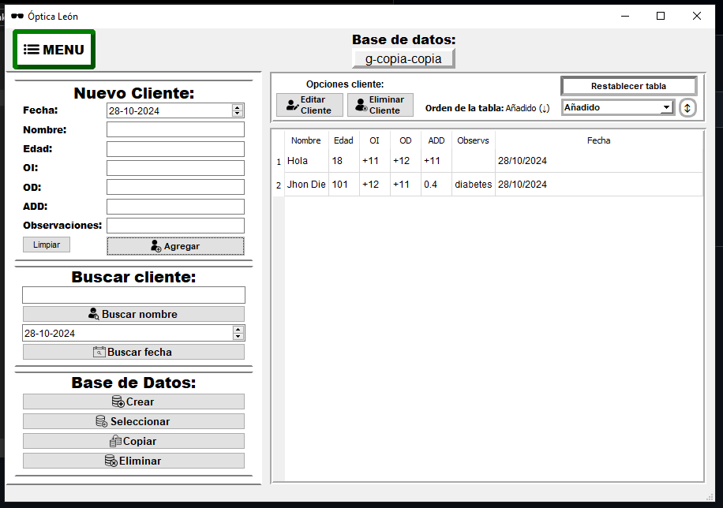

# Python-Optica-CRUD-GUI-PyQt5

CRUD en Python para administrar clientes de una óptica con interfaz gráfica creada en PyQt5. Permite agregar, editar y eliminar clientes, con opciones avanzadas de manejo de la base de datos.

## Tecnologías
- Python 3.12.1 (PyQt5 5.15.10)
- SQLite3 3.41.2
- Conda 23.11.0
- Git 2.43.0

## Funcionalidades
- **Clientes**: Agregar, editar y eliminar clientes en una tabla interactiva y ordenable por fecha de añadido, nombre y fecha de registro.
- **Base de datos**: Crear, copiar, seleccionar y eliminar la base de datos de clientes.
- **Búsqueda**: Filtrar clientes por nombre o fecha.
- **Interfaz**: Tabla de clientes editable y responsiva.

## Estructura de archivos
- `Optica.exe`: Archivo que empaqueta toda la logica y recursos del programa en un único ejecutable.
- `main.py`: Lógica principal del programa (ejecutar este archivo para iniciar el programa).
- `conexion.py`: Maneja consultas a la base de datos SQLite.
- `VentanaPrincipal.py`: Interfaz gráfica principal.
- `VentanaEdicion.py`: Ventana para editar clientes.
- `imagenes_ui.py`: Configuración de iconos.
- `requirements.txt`: Incluye los complementos necesarios para correr el programa desde el main.py (pip install -r requirements.txt)
- Carpeta `images`: Contiene los recursos de imágenes.
